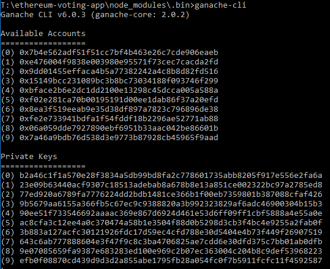
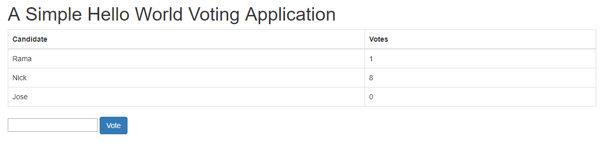

# Description

This voting dapp project were built for learning about blockchain, dapp and smart contract with NodeJS + Web3JS.

# Run simulation blockchain

Run command
```
$ node_module/.bin/ganache-cli
```
for simulation full client behavior. it will show wallet address for being use to test



# Deploy contract
  
  Run
  ```
  $ node
  ```
  then you will be in node console, run command as following
  ```
  > Web3 = require('web3')
  > web3 = new Web3(new Web3.providers.HttpProvider("http://localhost:8545"));
  ```
  above command were used to specific where does the blockchain run 
  ```
  > code = fs.readFileSync('Voting.sol').toString()
  > solc = require('solc')
  > compiledCode = solc.compile(code)
  ```
  above command were used to compile file smart contract `Voting.sol`.
  it will generate object with bytecode and interface.
  
  - bytecode is what we will put it in the blockchain. It works similar to backend
  - interface is something like structure of contract that we will use to interact with the contract (abi)
  
  ```
  > abiDefinition = JSON.parse(compiledCode.contracts[':Voting'].interface)
  > VotingContract = web3.eth.contract(abiDefinition)
  > byteCode = compiledCode.contracts[':Voting'].bytecode
  > deployedContract = VotingContract.new(['Rama','Nick','Jose'],
  {data: byteCode, from: web3.eth.accounts[0], gas: 4700000})
  ```
  above is assigning an abi and deploying contract
  ```
  > contractInstance = VotingContract.at(deployedContract.address)
  ```
  finally, pair abi to address where we put the contract
  
# Edit & run Dapp

1. Edit file `index.js` by change contract address to where your contract were put `deployedContract.address`

2. Open file `index.html` ผ่าน brower เพื่อเข้าถึง Dapp



3. เป็น Dapp สำหรับการโหวต สามารถใส่ชื่อในตารางลงในช่องว่างเพื่อกดโหวต

# Reference

[- original content](https://medium.com/@mvmurthy/full-stack-hello-world-voting-ethereum-dapp-tutorial-part-1-40d2d0d807c2)
